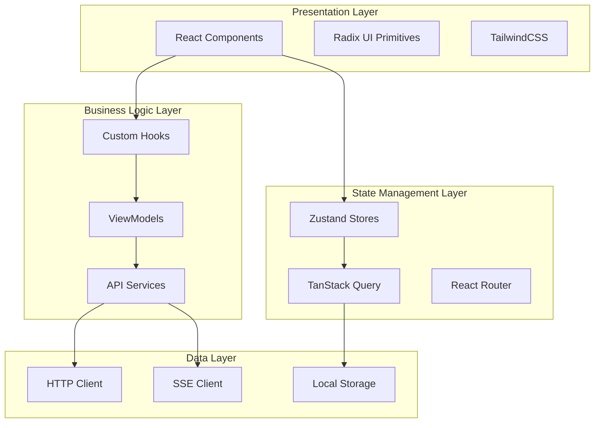
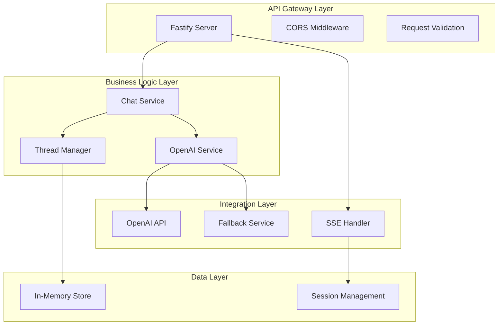
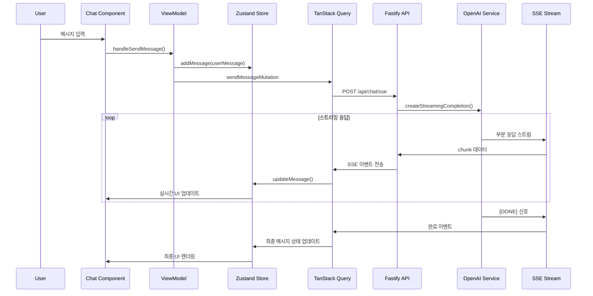
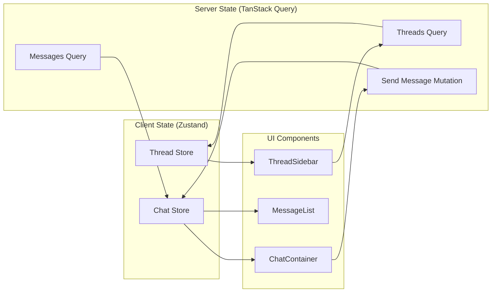
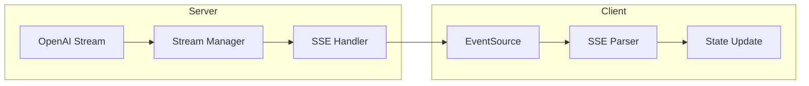
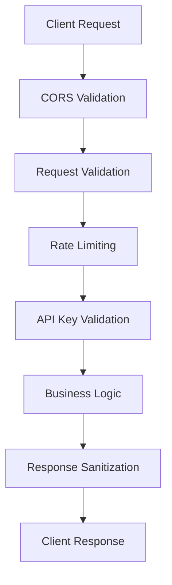
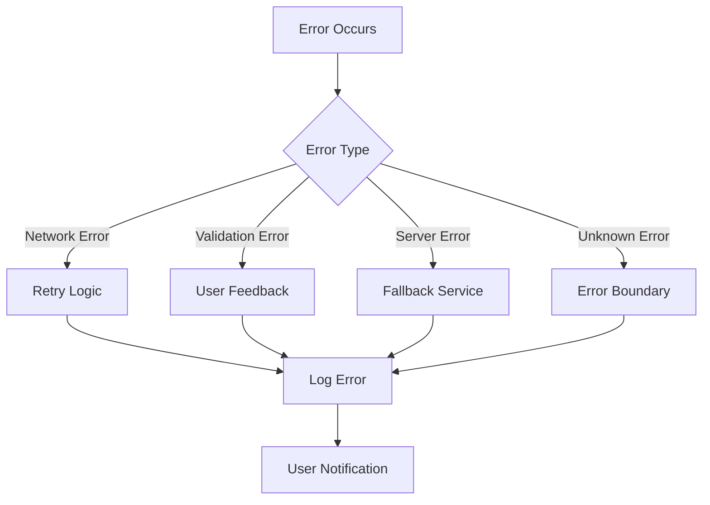

# Architecture Documentation

## 🏗️ 시스템 아키텍처 개요

AI Interface Project는 모던 웹 기술 스택을 기반으로 한 확장 가능한 실시간 AI 채팅 시스템입니다. Feature-Sliced Design(FSD) 패턴을 채택하여 유지보수성과 확장성을
극대화했습니다.

## 🎯 아키텍처 원칙

### 1. Separation of Concerns (관심사 분리)

- **Frontend**: UI/UX 및 사용자 상호작용 처리
- **Backend**: 비즈니스 로직 및 AI 서비스 통합
- **Shared**: 공통 타입 및 유틸리티

### 2. 단방향 데이터 플로우

- Redux/Zustand 패턴을 따른 예측 가능한 상태 관리
- 서버 상태와 클라이언트 상태의 명확한 분리

### 3. 반응형 아키텍처

- SSE를 통한 실시간 데이터 스트리밍
- 이벤트 기반 비동기 통신

## 🔧 기술 스택 상세

### Frontend Architecture



### Backend Architecture



## 📊 데이터 플로우 아키텍처

### Message Flow Architecture



### State Management Flow



## 🏛️ Feature-Sliced Design 구조

### FSD 레이어 구조

```
src/
├── app/                    # Application Layer
│   ├── providers/         # Global providers (Query, Router)
│   └── router/           # Route configurations
├── pages/                 # Pages Layer
│   ├── ChatPage/         # Chat page
│   └── HomePage/         # Home page
├── features/              # Features Layer
│   ├── chat/             # 채팅 기능
│   │   ├── api/          # API calls & queries
│   │   ├── model/        # State management
│   │   ├── lib/          # Business logic
│   │   └── ui/           # UI components
│   ├── thread/           # 스레드 관리 기능
│   ├── message/          # 메시지 표시 기능
│   └── assistant/        # AI 어시스턴트 기능
├── entities/             # Entities Layer
│   ├── chat/            # Chat entity
│   └── user/            # User entity
├── shared/               # Shared Layer
│   ├── api/             # Common API utilities
│   ├── lib/             # Utility functions
│   ├── ui/              # Reusable UI components
│   └── config/          # Configuration
└── widgets/              # Widgets Layer (deprecated)
```

### Feature Structure (Chat Feature 예시)

```
features/chat/
├── api/
│   ├── chatApi.ts        # HTTP 클라이언트
│   ├── queries.ts        # TanStack Query hooks
│   └── index.ts          # Public API exports
├── model/
│   ├── store.ts          # Zustand store
│   └── index.ts          # Public exports
├── lib/
│   ├── useChatViewModel.ts  # Business logic hook
│   └── index.ts          # Public exports
└── ui/
    ├── ChatContainer/    # Main chat component
    ├── InputBox/         # Message input component
    └── index.ts          # Public UI exports
```

## 🔄 상태 관리 아키텍처

### Zustand Store 구조

```typescript
// Chat Store Architecture
interface ChatState {
    // State
    messages: ChatMessage[];
    currentThreadId?: string;
    loading: boolean;

    // Actions
    setMessages: (messages: ChatMessage[]) => void;
    addMessage: (message: ChatMessage) => void;
    updateMessage: (messageId: string, updates: Partial<ChatMessage>) => void;
    removeMessage: (messageId: string) => void;
    setCurrentThreadId: (threadId?: string) => void;
    setLoading: (loading: boolean) => void;
    clearMessages: () => void;
}
```

### TanStack Query 구조

```typescript
// Query Keys 구조
export const QUERY_KEYS = {
    threads: {
        all: ['threads'] as const,
        list: () => [...QUERY_KEYS.threads.all, 'list'] as const,
        detail: (id: string) => [...QUERY_KEYS.threads.all, 'detail', id] as const,
        messages: (id: string) => [...QUERY_KEYS.threads.all, 'messages', id] as const,
    },
    chat: {
        all: ['chat'] as const,
        messages: (threadId?: string) => [...QUERY_KEYS.chat.all, 'messages', threadId] as const,
    },
} as const;
```

## 🌐 네트워크 아키텍처

### HTTP API 구조

```mermaid
graph TD
    subgraph "API Routes"
        A[/api/chat] --> B[REST Endpoints]
        C[/api/chat/sse] --> D[SSE Endpoints]
        E[/api/threads] --> F[Thread Management]
        G[/api/test] --> H[Health Checks]
    end

    subgraph "Middleware Stack"
        I[CORS]
        J[Request Validation]
        K[Error Handling]
        L[Logging]
    end

    subgraph "Services"
        M[OpenAI Service]
        N[Thread Manager]
        O[Fallback Service]
    end

    B --> I
    D --> I
    F --> I
    H --> I

    I --> J
    J --> K
    K --> L

    L --> M
    L --> N
    L --> O
```

### SSE 스트리밍 아키텍처



## 🔧 서비스 레이어 아키텍처

### OpenAI Service

```typescript
class OpenAIService {
    private client: OpenAI;

    async createStreamingChatCompletion(messages: ChatMessage[]): Promise<Stream> {
        // 스트리밍 채팅 완성 생성
    }

    isInitialized(): boolean {
        // 초기화 상태 확인
    }
}
```

### Thread Manager

```typescript
class ThreadManager {
    private threads: Map<string, ChatThread>;

    createThread(firstMessage?: string): ChatThread;

    getThread(threadId: string): ChatThread | undefined;

    addMessageToThread(threadId: string, message: ChatMessage): boolean;

    updateThreadTitle(threadId: string, title: string): boolean;
}
```

## 🚀 성능 최적화 아키텍처

### Frontend 최적화

1. **메모이제이션**

    ```typescript
    // React.memo for component memoization
    export const MessageItem = React.memo(({ message }) => {
        // Component implementation
    });

    // useMemo for expensive calculations
    const processedMessages = useMemo(() => {
        return messages.map(processMessage);
    }, [messages]);
    ```

2. **Query 최적화**
    ```typescript
    // Stale time 설정으로 불필요한 재요청 방지
    staleTime: 5 * 60 * 1000, // 5분
    gcTime: 10 * 60 * 1000,   // 10분
    ```

### Backend 최적화

1. **Fastify 성능 활용**

    - JSON 스키마 기반 빠른 직렬화
    - 플러그인 기반 모듈 시스템

2. **스트리밍 최적화**

    - 청크 단위 데이터 전송
    - 백프레셔 처리

3. **메모리 관리**
    - 인메모리 스레드 관리
    - 가비지 컬렉션 최적화

## 🔒 보안 아키텍처

### API 보안



### 데이터 보안

1. **환경 변수 관리**

    - OpenAI API 키를 환경 변수로 관리
    - 프로덕션 환경에서 시크릿 관리

2. **입력 검증**

    - Zod를 사용한 타입 안전한 검증
    - XSS 및 인젝션 공격 방지

3. **CORS 설정**
    - 허용된 도메인만 API 접근 가능
    - 프리플라이트 요청 처리

## 📈 모니터링 및 로깅

### 로깅 아키텍처

```typescript
// Fastify 로깅 설정
const fastify = Fastify({
    logger: {
        level: 'info',
        transport: {
            target: 'pino-pretty',
            options: {
                colorize: true,
            },
        },
    },
});
```

### 에러 처리



이 아키텍처는 확장성, 유지보수성, 성능을 고려하여 설계되었으며, 필요에 따라 점진적으로 개선할 수 있는 구조입니다.
